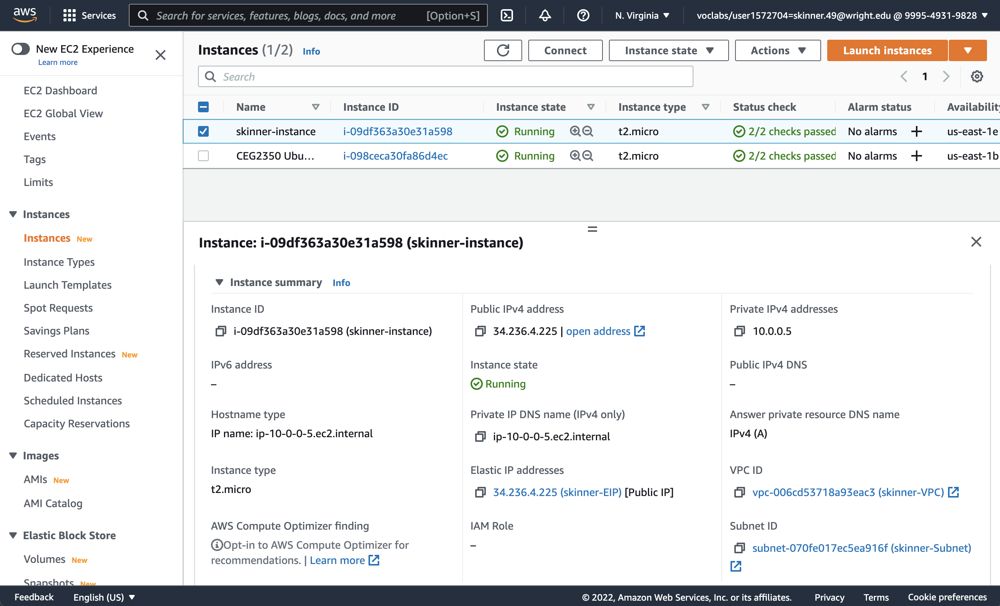
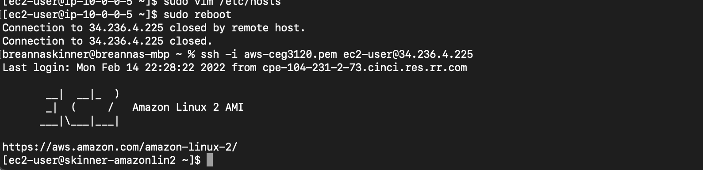

# Project 2  
## Part 1  
1. Create a VPC  
A VPC is a virtual network that is dedicated to my AWS account. It allows to create instances and resources on the cloud.  
  
2. Create a Subnet  
Allows to specify range of IP addresses inside my VPC. For this one /28 was used. Attached to the VPC using the drop down menu.  
  
3. Create an Internet Gateway 
For traffic to be able to get out and talk to the internet. Was attached to the VPC using the actions menu.  
   
4. Create a Routing Table  
A routing table determines where traffic is being directed to. A rule was created to send traffic to all destinations in internet gateway. Association to my subnet was made under the actions tab.  
  
5. Create a Security Group  
A "firewall" at network level. Created rules to allow inbound traffic from wsu, home (and where I do a lot of my homework) and communication between instance on the VPC.  
  
## Part 2  
1. I selected Amazon Linux 2 and the default user is ec2-user. I also selected the free tier t2.micro instance type.  
2. Under the configue instance settings I picked the VPC I created to for this project to attach this instance to my VPC.  
3. I chose to disable the auto assign public ip address so that I can make sure I have the same ip adress while I have this instance. This is done before I hit the review and launch button.  
4. Before the review and launch button again I went to the next menu option to assign a volume to my instance. I chose General Purpose SSD with 16 gb.  
5. The next option was to add a tag which I named skinner-instance.  
6. The last option before review and launch is associate a security group. I did this by using an existing security group and choosing the one I created for this project. Then I hit review and launch.  
7. I went to the elastic IPs tab and hit the Allocate Elastic IP Address button. Added the tag skinner-EIP and hit allocate. Then I hit the checkmark on the IP address and went to associate IP address under the actions drop down menu. I then chose the instance I made for this project and then the private IP address from the drop down menu.  
  
9. I used the comand `sudo homenamectl set-hostname skinner-amazonlin2.localdomain` then I used `sudo vim /etc/hosts` to add `skinner-amazonlin2.localdomain` to the first entry. Then i rebooted.  
