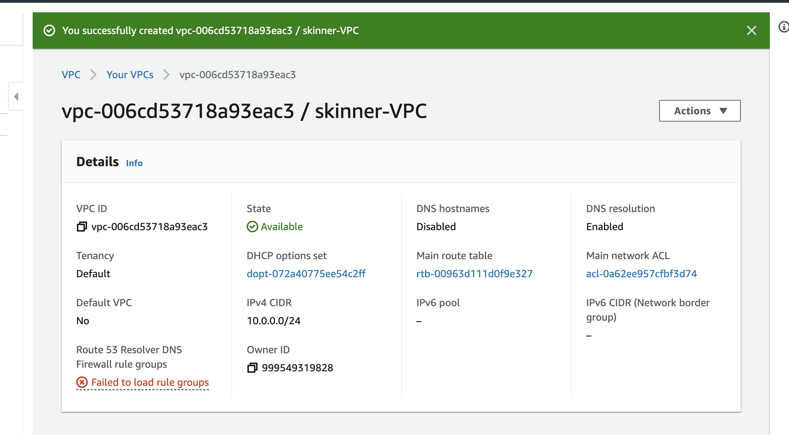
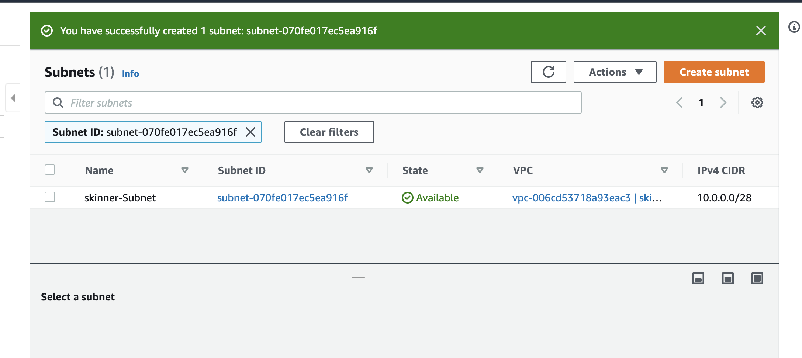
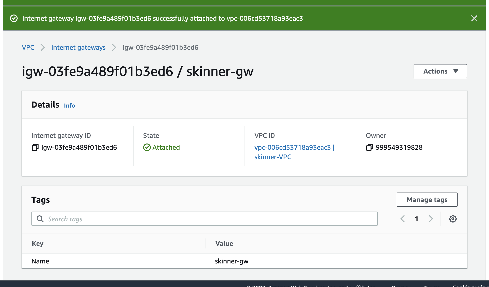
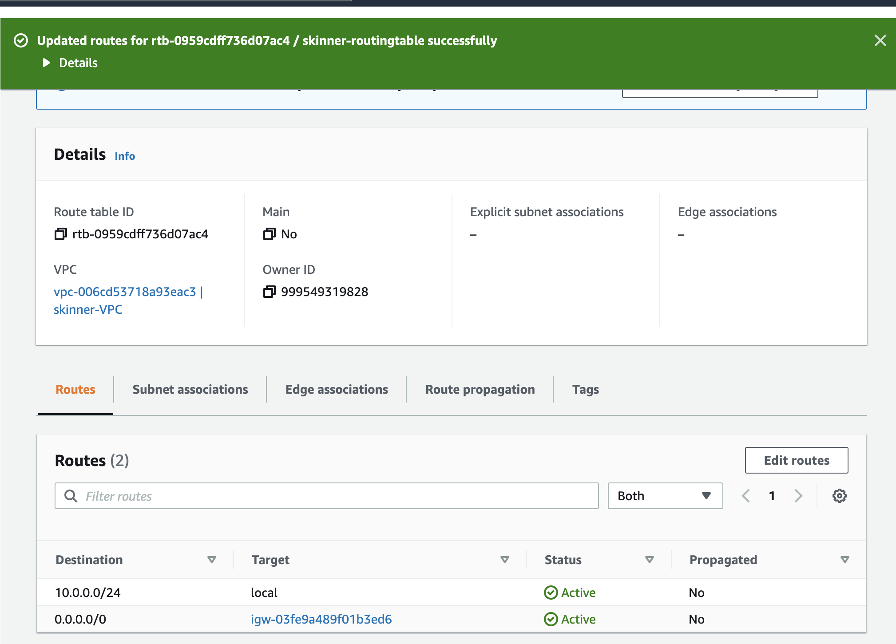
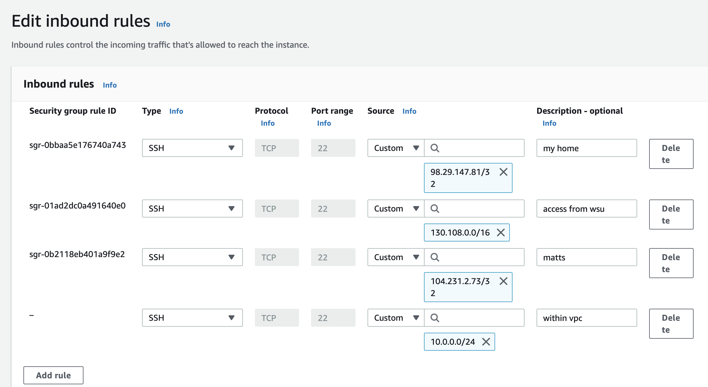

# Project 2  
## Part 1  
1. Create a VPC  
A VPC is a virtual network that is dedicated to my AWS account. It allows to create instances and resources on the cloud.  
  
2. Create a Subnet  
Allows to specify range of IP addresses inside my VPC. For this one /28 was used. Attached to the VPC using the drop down menu.  
  
3. Create an Internet Gateway 
For traffic to be able to get out and talk to the internet. Was attached to the VPC using the actions menu.  
   
4. Create a Routing Table  
A routing table determines where traffic is being directed to. A rule was created to send traffic to all destinations in internet gateway. Association to my subnet was made under the actions tab.  
  
5. Create a Security Group  
A "firewall" at network level. Created rules to allow inbound traffic from wsu, home and communication between instance on the VPC.  

