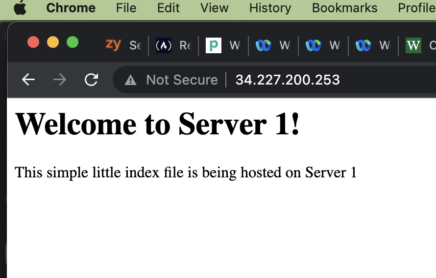
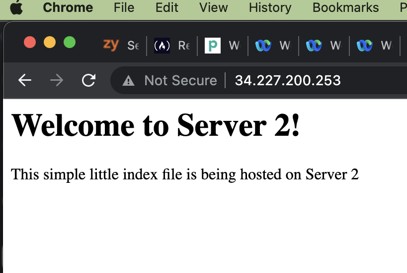

# Project 4
1. Add to the /etc/hosts file. Under the local host add each systems private IPs and then the names of them next to their IP. i.e. 10.0.0.10 proxy
2. ssh -i [key filename] [system name that was put into the hosts file]
3. The haproxy.cfg file was modified and it is located in /etc/haproxy. The frontend and backend configurations were set up. To restart use the command 'sudo systemctl restart haproxy'  
  
I used the lectures and https://www.haproxy.com/blog/the-four-essential-sections-of-an-haproxy-configuration/
4. On both servers the index.html files were modified to have the content in the html files given for the project. The old index file contents were copied to a backup file. No configurations were made. The files are located in /var/www/html/ because that's where the index files are located when apache is installed. To restart use the command 'sudo systemctl restart apache2' I used the lectures for this section. 
5. 
